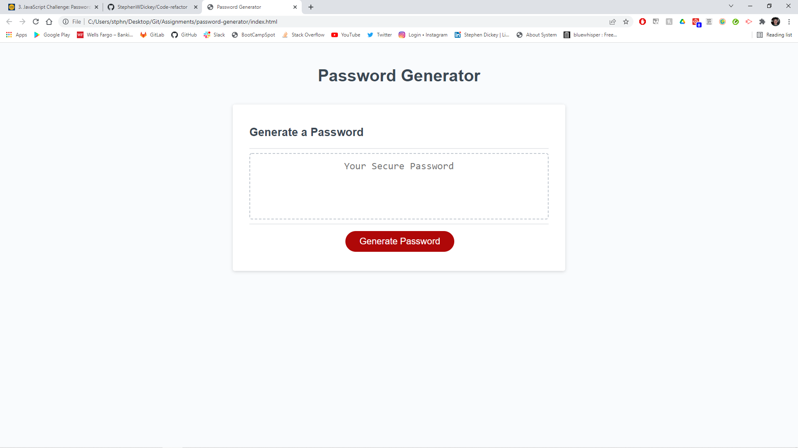

# Password Generator!

## Description
In this week's challenge we were tasked with creating a password generator. This password generator is suppossed to prompt the user, getting input as to:
* How long the password should be (must be between 8 and 128 characters)
* If the password will contain lowercase characters
* If the password will contain uppercase characters
* If the password will contain numbers
* If the password will contain special characters

For this challenge we had to program an html element to call a function that generated the password. This function also displays our password on the screen in text form. In the case of this assignment the button element accomplished this.

## Credits

StephenWDickey
GitHub page: https://github.com/StephenWDickey
Deployment URL: 

Joseph Jepson - Coding Bootcamp tutor
